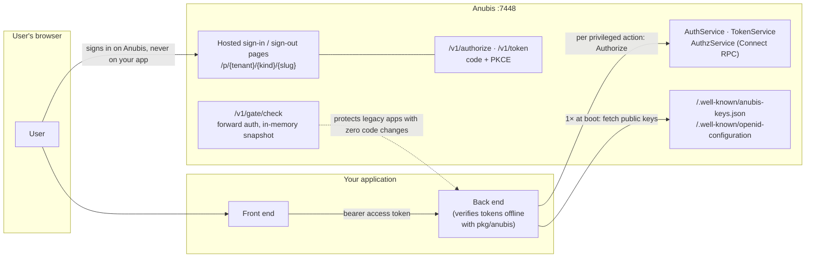
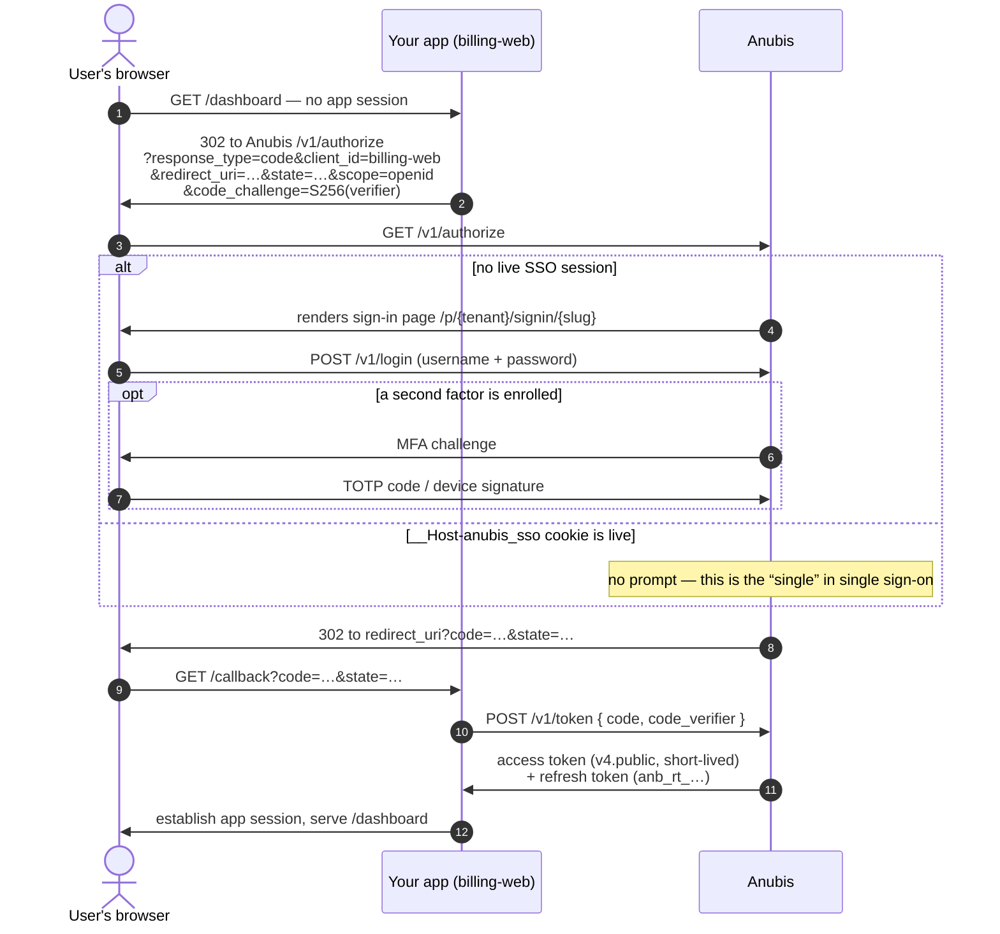
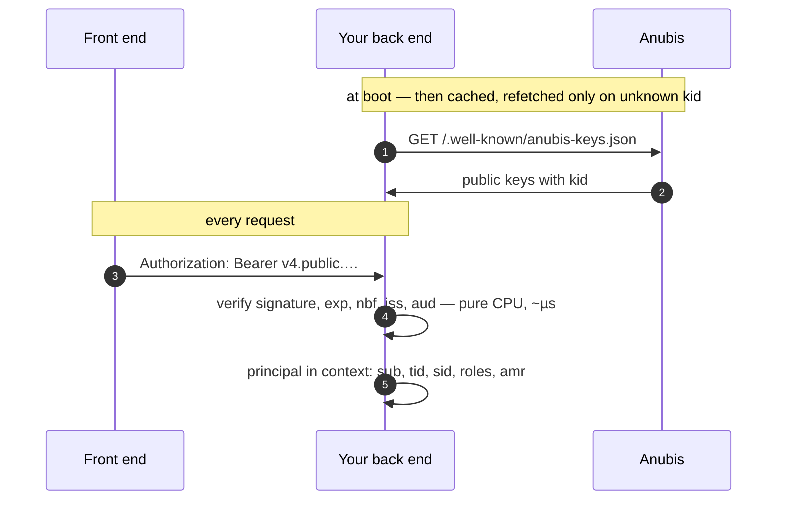
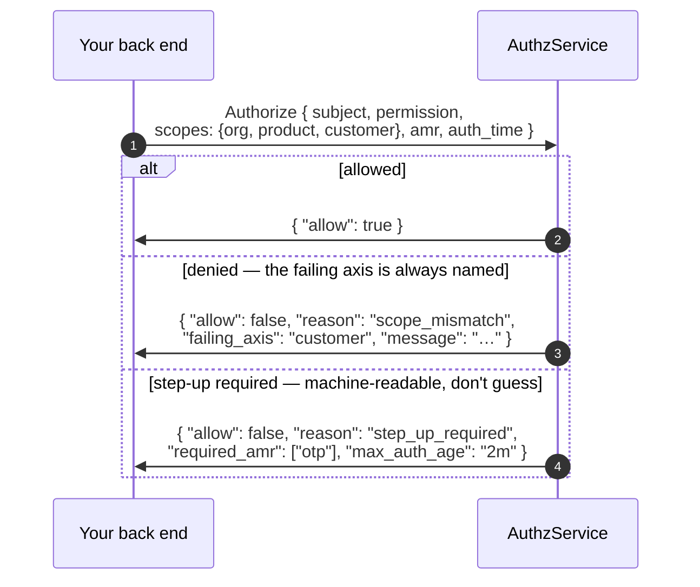
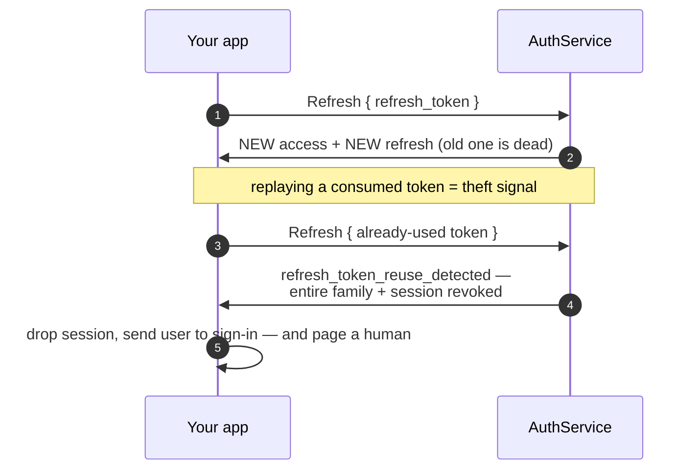
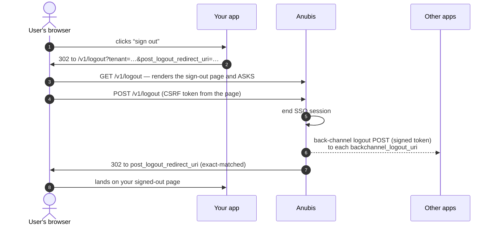
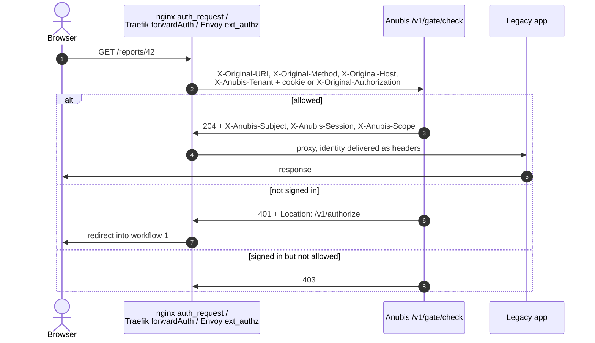

# Integrating an application with Anubis

How a relying party — *your* application — uses Anubis for authentication
(who is this?) and authorization (may they do this?). Every endpoint on this
page exists in the running server; the JSON mirrors `proto/anubis/v1`.

Anubis speaks two protocols on one port (`:7448`):

- **Connect RPC** — unary `POST /anubis.v1.<Service>/<Method>` with
  `Content-Type: application/json`. Works from `curl`, generated clients
  optional.
- **Plain HTTP** — the browser-facing OIDC-shaped flows (`/v1/authorize`,
  `/v1/token`, `/v1/logout`, hosted pages under `/p/…`), key discovery under
  `/.well-known/…`, and the forward-auth gate (`/v1/gate/check`).

## The big picture



Two rules fall out of the design and everything below follows from them:

1. **Passwords are typed only on Anubis's origin.** Your application never
   sees a credential — it receives tokens (browser flows) or presents its own
   (machine flows).
2. **Authentication is offline, authorization is a call.** Access tokens are
   PASETO `v4.public` — verify the Ed25519 signature locally with
   [`pkg/anubis`](../pkg/anubis), no network hop. Permission decisions come
   from `AuthzService.Authorize`, because they depend on grants, scopes and
   identity state that only Anubis holds — and change without your app
   redeploying.

---

## Step 0 — register the application (once)

An application in Anubis is a relying party: something a tenant's people sign
in to. In the console (**Access → Applications**), or via
`TenantAdminService`:

| You register | Why it matters |
| :--- | :--- |
| `slug` (= `client_id`) | Names the app in tokens (`aud`) and permission keys |
| `kind`: `spa` · `web` · `server` · `service` | `server`/`service` get a **client secret, shown once** |
| `redirect_uris` | Sign-in callbacks, matched **exactly** — no wildcards, no prefixes |
| `post_logout_redirect_uris` | A **separate** allowlist for after sign-out |
| `backchannel_logout_uri` | Anubis POSTs here on global logout |

Then publish the app's permission catalog with a **manifest**
(`TenantAdminService.ApplyManifest`, or the console's manifest dialog —
Check, then Apply):

```jsonc
{
  "permissions": [ { "key": "invoice:approve", "description": "…" } ],
  "roles":       [ { "name": "clerk", "permissions": ["invoice:approve"] } ]
}
```

Two naming rules that cost people real time: inside the manifest, roles
reference permissions as `resource:action` — **not** the full
`app:resource:action` key — and role names come back prefixed with the app
slug (`clerk` → `billing.clerk`). Everywhere *outside* the manifest (tokens,
`Authorize` calls) the permission is the full key: `billing:invoice:approve`.
Removed permissions are deprecated, never deleted — a live grant is never
orphaned.

---

## Workflow 1 — signing a user in (browser)

Authorization-code + PKCE. Applies to `web` and `spa` kinds; `web` apps also
send their client secret at the token exchange.



Details that are enforcement, not convention:

- `redirect_uri` is compared **exactly** against the registered allowlist.
  An open redirect here is full account takeover, so there is no fuzz in the
  match.
- **Which sign-in page renders**, most specific first: `?page=<slug>` → the
  page bound to your application → the tenant default. A missing or disabled
  page falls through rather than failing the flow — losing branding must
  never cost a user the ability to sign in.
- An enrolled second factor is **always demanded**; your app does nothing to
  trigger or handle it beyond following the redirects.
- The SSO cookie lives on Anubis's origin. The second application a user
  opens redirects to `/v1/authorize` and bounces straight back with a code —
  no prompt.

**First-party native/CLI apps** can skip the browser and call the RPC door
directly — `AuthService.Login`:

```jsonc
POST /anubis.v1.AuthService/Login
{ "tenant": "impack", "realm": "",            // empty realm = "internal"
  "username": "alice", "password": "…",
  "client_id": "billing-web", "device_fp": "…" }

// → { "tokens": { access + refresh } }
// or → { "mfa": { "mfa_token": "anb.local.v1.…", "methods": ["totp"] } }
//       then POST /anubis.v1.AuthService/VerifyMfa { mfa_token, code }
```

Failure responses are uniform in message **and timing** — the KDF runs even
for unknown users, so a login probe cannot enumerate accounts.

---

## Workflow 2 — verifying requests (every request, offline)

Your back end verifies the access token locally. No call to Anubis on the
request path.



```go
import "github.com/gsoultan/anubis/pkg/anubis"

v, err := anubis.NewVerifier(anubis.Config{
    Issuer:   "https://anubis.internal",
    Audience: "billing-web", // mandatory: without it you accept tokens minted for other apps
    KeysURL:  "https://anubis.internal/.well-known/anubis-keys.json",
})

mux.Handle("/api/", v.Middleware(apiHandler))          // 401s bad/missing tokens
mux.Handle("/api/payments/", v.Middleware(
    anubis.RequireAMR("otp")(paymentsHandler)))        // step-up: MFA-backed tokens only

// inside a handler
p, _ := anubis.FromContext(r.Context())
p.Claims.Subject  // usr_…       p.Claims.Tenant // tnt_…
p.Claims.Roles    // ["billing.clerk"]            p.Claims.AMR // ["pwd","otp"]
```

`pkg/anubis` is a **zero-dependency module** — importing it pulls in nothing
but stdlib. Non-Go services verify the same way with any PASETO `v4.public`
library plus the two claims checks (`iss`, `aud`); the signing `kid` rides in
the token footer.

Offline verification cannot see revocation — a token stays valid until `exp`
even if the session died. Access tokens are short-lived precisely so that
window is small. Where "valid until expiry" is not acceptable (admin planes,
irreversible actions), call `TokenService.Introspect` (service credentials
required) — it checks live session state, at the cost of putting Anubis in
your hot path.

---

## Workflow 3 — authorization (per privileged action)

Authentication said who they are. Whether they may **do** something is a
decision Anubis makes, because it depends on grants, scopes, memberships and
identity status that move without your app deploying.



```jsonc
POST /anubis.v1.AuthzService/Authorize
Authorization: Bearer <access token — or a tenant API key, see workflow 6>
{
  "subject": "usr_01HXY…",                     // Claims.Subject from the verified token
  "permission": "billing:invoice:approve",
  "scopes": { "org": "01a027ff-…", "customer": "01a027fb-…" },
  "amr": ["pwd","otp"], "auth_time": 1735689000   // from the token; enables step-up decisions
}
```

The semantics your code must respect (ADR-0004):

- **Supply every axis the action touches.** Within an axis, any granted node
  at or above the target satisfies it (OR); across axes, all must hold
  (AND). On a strict axis an **omitted axis is denied, not ignored** —
  fail-closed is the whole design.
- **Self-scoped access** passes the record owner under the reserved key
  `_owner`: `"scopes": { "_owner": "usr_applicant…" }`. A self-scoped grant
  with no `_owner` supplied is denied.
- **`step_up_required` is machine-readable.** Send the user through
  `/v1/authorize` again to satisfy `required_amr`, then retry. Do not guess.
- **Deprovisioning needs no cooperation from you.** A disabled identity is
  denied (`identity_inactive`) on the next decision, whatever tokens it
  still holds.
- A denial you don't understand: `AuthzService.Explain` returns which grant
  matched, which role conferred the permission, and — on denial — exactly
  which axis failed and why. The console's access playground renders the
  same explanation.

---

## Workflow 4 — keeping the session alive (refresh rotation)



Refresh tokens are **single-use**: every refresh returns a rotated pair.
Store the new one before discarding the old. `refresh_token_reuse_detected`
means two parties presented the same token — one of them is an attacker; the
family and session are already revoked. Treat it as a security event, not a
retry.

---

## Workflow 5 — signing out



- `GET` asks first because a bare GET that ends sessions is reachable from
  any page on the internet with an `` tag. The POST's CSRF token
  rotates on every render.
- `post_logout_redirect_uri` is exact-matched against
  `post_logout_redirect_uris` — a **separate** allowlist from sign-in
  callbacks. An unregistered address is refused, not silently redirected:
  "you have been signed out, sign in again" is a phishing primitive when the
  link really does come from the identity provider.
- **Your app must handle the back-channel logout POST** by ending its own
  session for the named `sid`. Without it, an app with its own cookie keeps
  the user signed in after they signed out everywhere.
- RPC-side equivalents: `AuthService.Logout` (this session),
  `LogoutAll` (every session — this is what triggers back-channel logout),
  `LogoutSession` (one named device).

---

## Workflow 6 — no user present (machine to machine)

Two credentials, two shapes of caller:

**Client credentials** — a registered `server`/`service` application acting
as *itself* (nightly jobs, internal services calling each other):

```jsonc
POST /anubis.v1.AuthService/ClientCredentials
{ "tenant": "impack", "client_id": "billing-batch",
  "client_secret": "…", "audience": "reporting-api" }   // audience defaults to the caller itself

// → bare access token: no refresh, no session; sub = "app_billing-batch"
```

The receiving service verifies it with the same `pkg/anubis` middleware —
`aud` binding is what stops a token minted for one service being replayed
against another (the confused-deputy case the `Audience` config field
exists for).

**Tenant API key** — `anb_live_<lookup>.<secret>`, created on the
Applications screen. The key is the **tenant's** credential, not a person's:
it authenticates as the tenant's system and is meant for the decision API —
a trusted back end asking `Authorize`/`Explain` about its users (the
`Authorization: Bearer anb_live_…` in workflow 3). Revocation is immediate,
and a suspended tenant's keys stop with it. Keys are refused on the admin
plane — administration is performed by platform operators, not credentials.

---

## Workflow 7 — protecting an app you cannot modify (forward auth)

For legacy or third-party apps: the reverse proxy asks Anubis before every
request. Zero code changes in the app behind it.



Route policies ship in the application manifest, so "who may reach
`/reports/*`" lives next to the permissions it depends on. Decisions are
served entirely from an in-memory snapshot — no database on the path, gate
p99 < 1 ms — and the gate **fails closed** if the snapshot outlives its
maximum age (`/readyz` fails first, so the instance leaves the load
balancer before it starts denying).

---

## Branding the hosted pages

The sign-in and sign-out pages are served by Anubis at
`/p/{tenant}/{kind}/{slug}` and configured per tenant. **The config is a closed
token set, never markup or CSS.** A tenant cannot inject a script or a
stylesheet because there is nowhere to write one down — which is also why
adding a capability means adding a token, not opening a field.

| Section | Fields |
| :--- | :--- |
| `brand` | `title`, `logo_url`, `primary_color`, `background_color`, `text_color`, `corner_radius` (`none`/`sm`/`md`/`lg`/`full`), `font` (`system`/`serif`/`mono`) |
| `layout` | `centered`, `split`, `minimal` |
| `copy` (sign-in) | `heading`, `subheading`, `username_label`, `password_label`, `submit_label` |
| `copy` (sign-out) | `confirm_heading`, `confirm_body` — asking; `heading`, `body`, `return_label` — afterwards |
| `features` (sign-in) | `show_realm_picker`, `show_registration`, `show_forgot_password`, `remember_me` |
| `behavior` (sign-out) | `confirm`, `auto_redirect_seconds` (0–30), `default_return_url` |
| `motion` | `entrance`: `none`, `fade`, `rise` |
| `links` | up to 5 `{label, url}` |

`logo_url` is rendered as an ``; `javascript:` and `data:` URLs are
rejected. Every field is validated server-side and the error names the field,
so a console can point at the input rather than saying "invalid
configuration".

**Sign-out is two pages in one.** The confirm step asks before ending the
session; the signed-out step is what remains after. They draw from different
copy fields, which is why the console previews both.

**Motion respects the visitor, not the tenant.** The entrance is emitted only
inside `@media (prefers-reduced-motion: no-preference)`, so somebody who asked
their system for less motion sees none — and so does anyone whose browser does
not answer. It animates opacity and transform only, over 200 ms, and never
delays the form becoming usable.

### Which page a visitor gets

```
explicit slug  ->  application  ->  realm  ->  tenant default
```

A page may be bound to an application or to a realm, never both. The realm is
the population — internal, partner, public — and comes from `?realm=`, so
`/v1/authorize?...&realm=partner` reaches the partner door. An application
that has its own page keeps it regardless of who is signing in.

That order is worth knowing before you need it: when the wrong brand appears
in front of the wrong population, it is almost always a binding higher in this
list than the one you were looking at.

---

## Choosing the flow

| Your application is… | Sign in via | Verify via | Authorize via |
| :--- | :--- | :--- | :--- |
| Browser app with a back end (`web`) | Workflow 1 (code + PKCE + secret) | `pkg/anubis` middleware | `Authorize` RPC |
| Single-page app (`spa`) | Workflow 1 (code + PKCE) | your API verifies its bearer | your API calls `Authorize` |
| First-party native / CLI | `AuthService.Login` RPC | `pkg/anubis` | `Authorize` RPC |
| Service calling services (`service`) | `ClientCredentials` | receiver's `pkg/anubis`, `aud` pinned | `Authorize` where user-scoped |
| Trusted back end asking about users | — | — | `Authorize` with a tenant API key |
| Legacy app behind a proxy | Workflow 7 redirects into workflow 1 | the gate | route policies in the manifest |

## Integration checklist

1. Register the application: exact `redirect_uris`,
   `post_logout_redirect_uris`, `backchannel_logout_uri`; keep the
   once-shown secret in your secret store.
2. Apply the manifest; confirm roles arrived as `<slug>.<name>`.
3. Implement the callback: exchange `code` + `code_verifier` at
   `/v1/token`, validate `state`.
4. Mount the verifier middleware with `Audience` set to your slug. Never
   skip the `aud` check.
5. Call `Authorize` before privileged actions, passing **every** axis the
   action touches; handle `step_up_required` by re-entering sign-in, not by
   guessing.
6. Refresh with rotation; on `refresh_token_reuse_detected`, kill the
   session and alert.
7. Implement the back-channel logout receiver; sign users out via
   `/v1/logout`, landing only on registered URIs.
8. Alert on `refresh_token_reuse_detected` and on step-up denials for
   actions that should never need them — both are signals, not noise.
